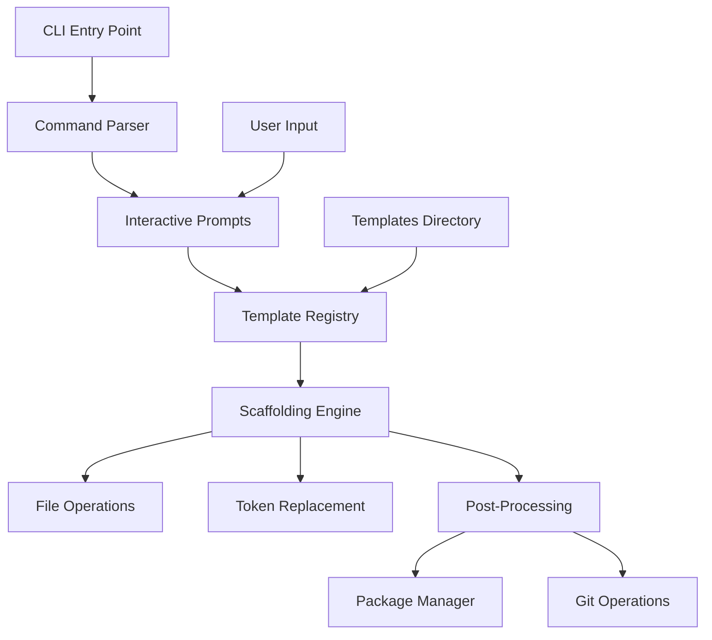

# Design Document

## Overview

Peezy is a Node.js/TypeScript CLI application that provides instant project scaffolding across multiple runtime environments. The tool uses a template-based approach with embedded templates, token replacement, and interactive prompting to create ready-to-run projects with minimal user input.

The architecture follows a modular design with clear separation between CLI interface, scaffolding logic, and external integrations (package managers, git). The tool is designed to work offline and provide a consistent experience across different operating systems.

## Architecture

### High-Level Architecture



### Core Components

1. **CLI Interface Layer**: Handles command parsing, argument validation, and user interaction
2. **Template Management**: Registry system for template discovery and validation
3. **Scaffolding Engine**: Core logic for project creation and file manipulation
4. **Integration Layer**: Handles external tool integration (git, package managers)
5. **Utility Layer**: Common functionality for file operations, logging, and error handling

## Components and Interfaces

### CLI Interface (`src/index.ts`)

**Responsibilities:**

- Command line argument parsing using Commander.js
- Interactive prompting using prompts library
- Orchestrating the scaffolding workflow
- Error handling and user feedback

**Key Methods:**

- `list()`: Display available templates
- `new(template?, name?, options?)`: Create new project with optional prompts

### Template Registry (`src/registry.ts`)

**Responsibilities:**

- Template discovery and registration
- Template metadata management
- Path resolution for template files
- Popular template identification and ordering

**Interface:**

```typescript
interface TemplateDefinition {
  title: string;
  path: string;
  popular?: boolean;
}

interface TemplateRegistry {
  [key: string]: TemplateDefinition;
}
```

### Scaffolding Engine (`src/actions/scaffold.ts`)

**Responsibilities:**

- Project directory creation and validation
- Template file copying with directory structure preservation
- Token replacement in template files
- File system operations coordination

**Key Methods:**

- `scaffold(templateKey: string, destName: string): string`
- Validates destination directory
- Copies template files recursively
- Applies token replacement

### File System Utilities (`src/utils/fsx.ts`)

**Responsibilities:**

- Recursive directory copying
- Token replacement in text files
- File system validation and error handling

**Key Methods:**

- `copyDir(src: string, dest: string): void`
- `replaceTokens(dir: string, tokens: Record<string, string>): void`

### Package Manager Integration (`src/actions/install.ts`)

**Responsibilities:**

- Package manager detection and execution
- Dependency installation with proper error handling
- Support for multiple package managers (npm, yarn, pnpm, bun)

**Interface:**

```typescript
type PackageManager = "bun" | "npm" | "pnpm" | "yarn";
function installDeps(pm: PackageManager, cwd: string): Promise<void>;
```

### Git Integration (`src/actions/git.ts`)

**Responsibilities:**

- Git repository initialization
- Initial commit creation
- Git command execution with error handling

**Key Methods:**

- `initGit(cwd: string): Promise<void>`
- Executes git init, add, and commit sequence

### Logging Utility (`src/utils/logger.ts`)

**Responsibilities:**

- Consistent logging interface with color coding
- Different log levels (info, success, warning, error)
- Terminal-friendly output formatting
- Light/dark theme compatible color schemes

## Data Models

### Template Structure

Each template follows a standardized directory structure:

```
templates/{template-name}/
├── package.json (with tokens)
├── README.md (with tokens)
├── configuration files
├── src/
│   └── source files (with tokens)
└── other template-specific files
```

### Token System

**Supported Tokens:**

- `__APP_NAME__`: Human-readable application name
- `__PKG_NAME__`: Package-safe name (kebab-case, sanitized)

**Token Processing Rules:**

- Applied to all text files recursively
- Binary files are copied without modification
- Package name sanitization removes special characters and converts to kebab-case

### Configuration Model

```typescript
interface NewOptions {
  template?: TemplateKey;
  name?: string;
  install?: boolean;
  git?: boolean;
  pm?: PackageManager;
}
```

## Error Handling

### Error Categories

1. **Validation Errors**: Invalid template names, missing required arguments
2. **File System Errors**: Permission issues, disk space, existing directories
3. **External Tool Errors**: Package manager failures, git command failures
4. **Template Errors**: Missing or corrupted template files

### Error Handling Strategy

- **Graceful Degradation**: Continue operation when non-critical steps fail
- **Clear Error Messages**: Provide actionable error information to users
- **Rollback Capability**: Clean up partial operations on critical failures
- **Warning vs Error**: Distinguish between blocking and non-blocking issues

### Specific Error Scenarios

- **Destination Exists**: Fail fast with clear message, no overwrite
- **Package Install Failure**: Warn but continue, project still usable
- **Git Init Failure**: Warn but continue, manual git setup possible
- **Template Not Found**: Fail with list of available templates
- **Permission Denied**: Fail with clear permission error message

## Testing Strategy

### Unit Testing

**Test Coverage Areas:**

- Template registry functionality
- Token replacement logic
- File system operations
- Command line argument parsing
- Error handling scenarios

**Testing Framework:** Jest with TypeScript support

**Key Test Cases:**

- Token replacement with various input formats
- Directory copying with nested structures
- Error handling for invalid inputs
- Package manager command generation
- Git operation sequencing

### Integration Testing

**Test Scenarios:**

- End-to-end project creation with each template
- Interactive prompt flows
- Package manager integration
- Git repository initialization
- Cross-platform compatibility

### Template Validation

**Automated Checks:**

- Template file structure validation
- Token presence verification
- Package.json validity
- README.md completeness

### Manual Testing

**Test Matrix:**

- Each template × each package manager
- Interactive vs command-line argument modes
- Error scenarios (permissions, existing directories)
- Cross-platform testing (macOS, Linux, Windows)

## Implementation Considerations

### Performance

- **Template Loading**: Templates loaded on-demand to minimize startup time
- **File Operations**: Efficient recursive copying with minimal memory usage
- **Process Spawning**: Proper cleanup of child processes for package managers and git

### Security

- **Path Traversal Prevention**: Validate template paths and destination directories
- **Command Injection Prevention**: Sanitize inputs passed to external commands
- **File Permission Handling**: Respect system file permissions and ownership

### Cross-Platform Compatibility

- **Path Handling**: Use Node.js path module for cross-platform path operations
- **Command Execution**: Handle different shell environments and command availability
- **File System**: Account for different file system behaviors and permissions

### Extensibility

- **Template Registry**: Easy addition of new templates through registry updates
- **Plugin Architecture**: Modular design allows for future plugin system
- **Configuration**: Support for user-level and project-level configuration files

### User Interface Design

**Color Scheme:**

- Use ANSI colors that work well in both light and dark terminals
- Info messages: Cyan (readable on both backgrounds)
- Success messages: Green (universally positive)
- Warning messages: Yellow (caution indicator)
- Error messages: Red (clear danger signal)
- Accent elements: Bright colors for highlights and popular indicators

**Popular Template Indicators:**

- Use emoji or Unicode symbols (⭐, 🔥) to mark popular templates
- Group popular templates at the top of selection lists
- Consider visual hierarchy in prompt design

### Build and Distribution

- **TypeScript Compilation**: Compile to ES2022 modules for Node.js compatibility
- **Package Structure**: Include compiled JavaScript, templates, and executable wrapper
- **NPM Publishing**: Automated build process with proper file inclusion/exclusion
- **Version Management**: Semantic versioning with automated changelog generation
